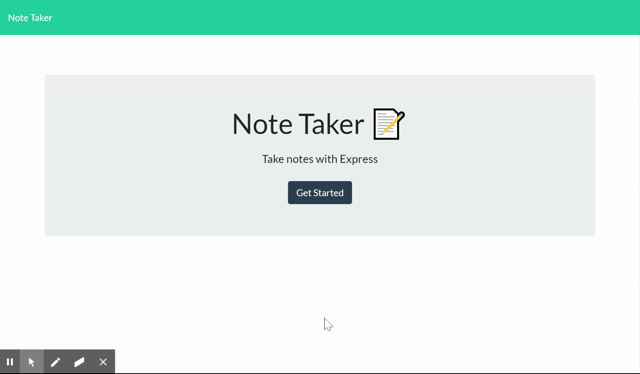

# [Note Taker](https://notaking.herokuapp.com/)
> This application lets the user save and delete Notes.

## Table of contents
* [General info](#general-info)
* [Screenshots](#screenshots)
* [Technologies](#technologies)
* [Setup](#setup)
* [Usage](#usage)
* [Features](#features)
* [Status](#status)
* [Inspiration](#inspiration)
* [Contact](#contact)

## General info
This project includes html files,test files and javascript files for backend coding. It then connects the backend to front end to display the information. The purpose of this project is to allow user to add their Notes to the page.


## Screenshots



## Technologies
* Tech 1 - initial html files and starter codes provided from [TriologyEd](https://www.trilogyed.com/)
* Tech 2 - for some styling used [bootstrap](https://getbootstrap.com/)
* Tech 3 - for icons used [font awesome](https://fontawesome.com/)
* Tech 4 - express npm package [express](https://www.npmjs.com/package/express)
* Tech 5 - path npm package [path](https://nodejs.org/docs/latest/api/path.html)

## Setup
In order to run this application you will need node installed which can be downloaded from [Download Node](https://nodejs.org/en/download/) You will need Visual Code as well [Visual Code](https://code.visualstudio.com/)

After installations, Once you download the files, You can open the terminal and type the command ``` npm install ``` This will install the dependencies required such as express to run this application. After the install is finished if you run the command ``` node server.js``` in terminal, it will connect you to the server. Then once you type the ```http://localhost:5050/``` in the browser you can start the appliaction.

## Usage
In order to use this application you can use this [link](https://notaking.herokuapp.com/) , You would add a title and a note. Then you click the save buton and it will save your notes. You can then use the trash button to delete a note.

## Features
* Feature 1: The user can save or delete notes using this app.
* Feature 2: This project is using express npm package.


To-do list:

* Improvement to be done : This application can be improved on how it is using the CRUD (create, read, update and delete).


## Status
Project is:  _in progress_

## Inspiration
This project is useful because it can save your notes to the page. The use of back end coding to display inforamtion in html files and use of constructor classes was the inspiration to this project.

## Contact
Email: notitiami@gmail.com

LinkedIn: [Valerio Varani](https://www.linkedin.com/in/valerio-varani-635ba31a1/)

feel free to contact me!